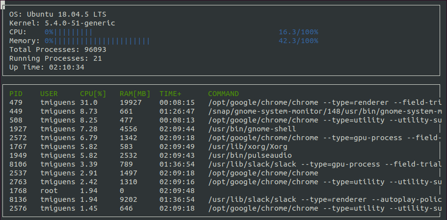

# CppND-System-Monitor

Starter code for System Monitor Project in the Object Oriented Programming Course of the [Udacity C++ Nanodegree Program](https://www.udacity.com/course/c-plus-plus-nanodegree--nd213). 

Follow along with the classroom lesson to complete the project!


## Udacity Linux Workspace
[Udacity](https://www.udacity.com/) provides a browser-based Linux [Workspace](https://engineering.udacity.com/creating-a-gpu-enhanced-virtual-desktop-for-udacity-497bdd91a505) for students. 

You are welcome to develop this project on your local machine, and you are not required to use the Udacity Workspace. However, the Workspace provides a convenient and consistent Linux development environment we encourage you to try.

## ncurses
[ncurses](https://www.gnu.org/software/ncurses/) is a library that facilitates text-based graphical output in the terminal. This project relies on ncurses for display output.

Within the Udacity Workspace, `.student_bashrc` automatically installs ncurses every time you launch the Workspace.

If you are not using the Workspace, install ncurses within your own Linux environment: `sudo apt install libncurses5-dev libncursesw5-dev`

## Make
This project uses [Make](https://www.gnu.org/software/make/). The Makefile has four targets:
* `build` compiles the source code and generates an executable
* `format` applies [ClangFormat](https://clang.llvm.org/docs/ClangFormat.html) to style the source code
* `debug` compiles the source code and generates an executable, including debugging symbols
* `clean` deletes the `build/` directory, including all of the build artifacts

## Instructions

1. Clone the project repository: `git clone https://github.com/udacity/CppND-System-Monitor-Project-Updated.git`

2. Build the project: `make build`

3. Run the resulting executable: `./build/monitor`


4. Follow along with the lesson.

5. Implement the `System`, `Process`, and `Processor` classes, as well as functions within the `LinuxParser` namespace.

6. Submit!

## Development & test environment

```
18.04.5 LTS (Bionic Beaver)
Linux 5.4.0-48-generic #52~18.04.1-Ubuntu x86_64 GNU/Linux

$ sudo apt search libncurses5-dev
libncurses5-dev/bionic-updates,now 6.1-1ubuntu1.18.04 amd64 [installed]
  developer's libraries for ncurses

$ sudo apt search libncursesw5-dev
libncursesw5-dev/bionic-updates,now 6.1-1ubuntu1.18.04 amd64 [installed]
  developer's libraries for ncursesw

$ /usr/bin/cmake --version
cmake version 3.18.1

$ /usr/bin/c++ --version
c++ (Ubuntu 7.5.0-3ubuntu1~18.04) 7.5.0

$ clang-format-10 --version
clang-format version 10.0.0-4ubuntu1~18.04.2
```

## Features
This monitor has the following interactive features
* Up arrow to toggle (ascending/descending) process list sort-by-CPU
* Down arrow to toggle (ascending/descending) process list sort-by-RAM
* `+` key to increase number of processes shown
* `-` key to decrease number of processes shown
* `q` key to exit

The following summarises the extra functionality implemented in this project
* ✅ Calculate CPU utilization dynamically, based on recent utilization
* ✅ Sort processes based on CPU or memory utilization (use up/arrow keys to toggle)
* ✅ Make the display interactive (see list above)
* ✅ Restructure the program to use abstract classes (interfaces) and pure virtual functions *
* ❌ Port the program to another operating system

\* (see `refresh.h` and `utilization.h` interfaces)

## Preview

The image below shows how the monitor looks on my machine (see `Development & test environment` section above)


